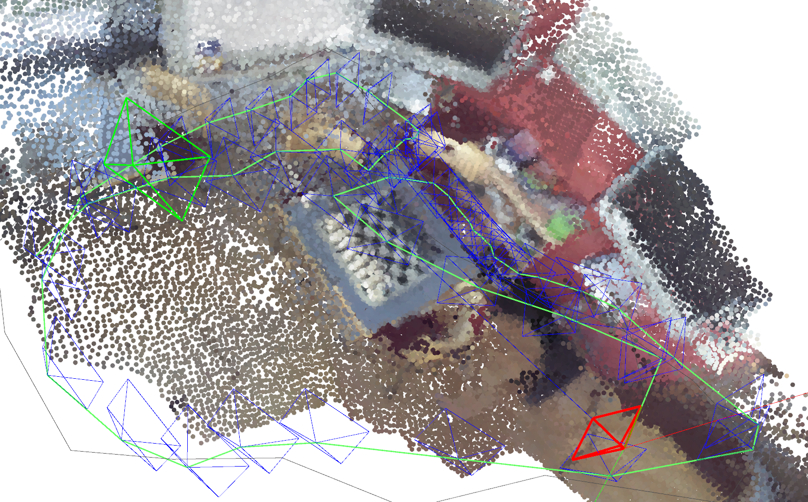
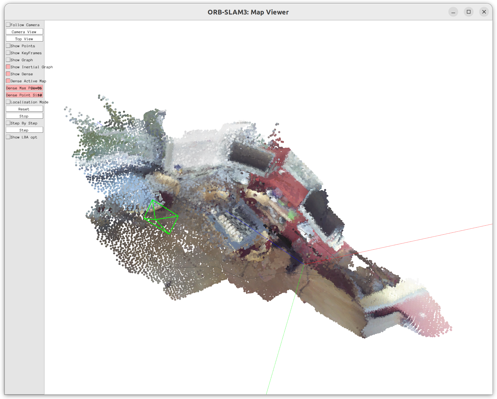
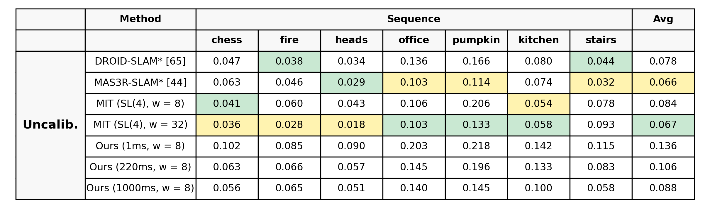
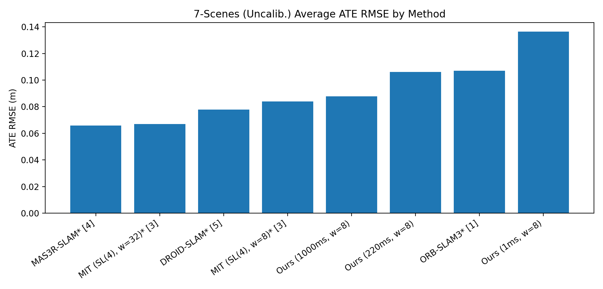
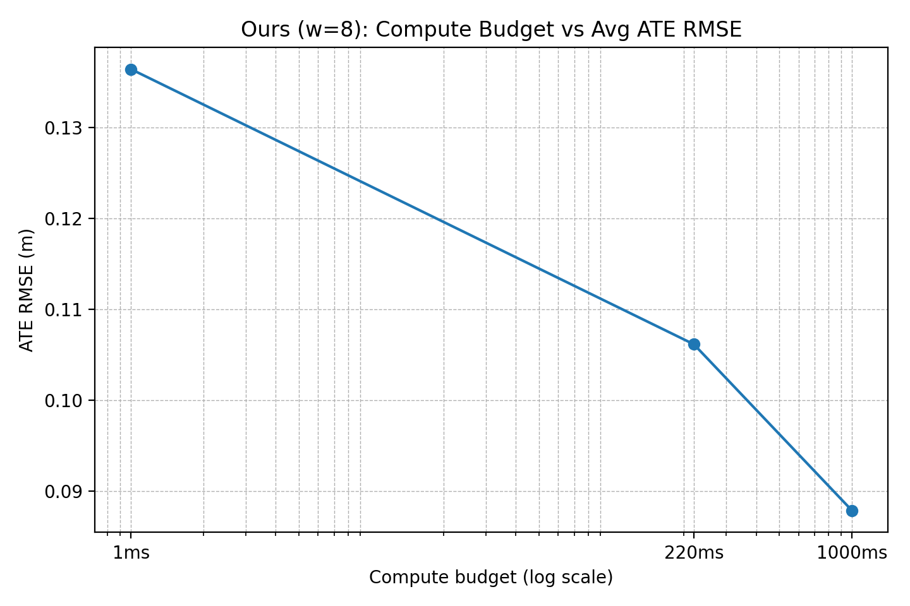
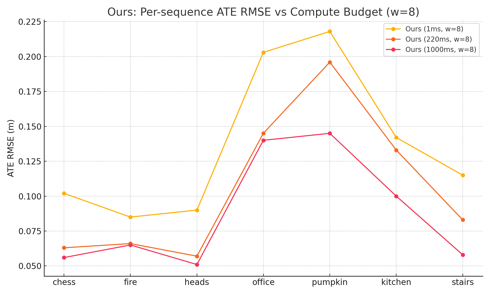
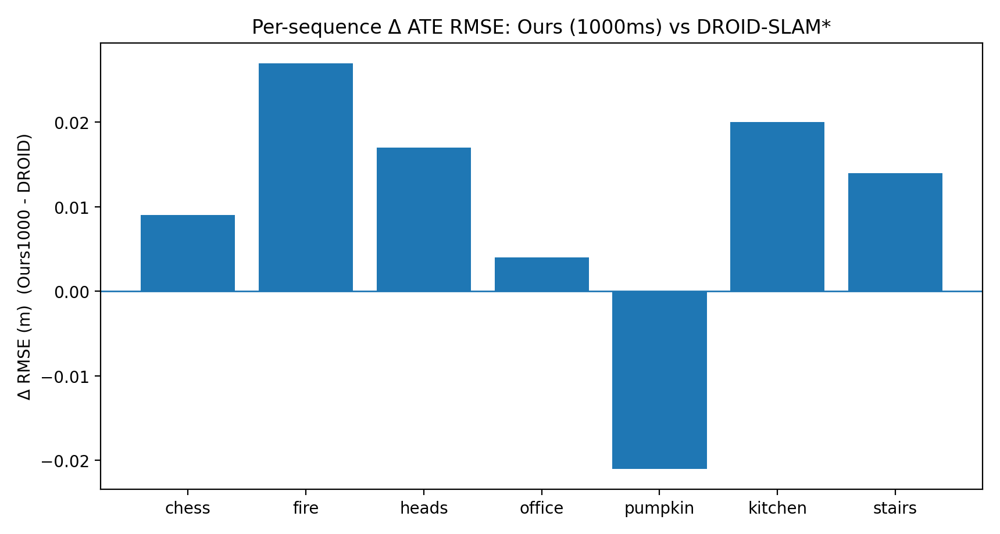
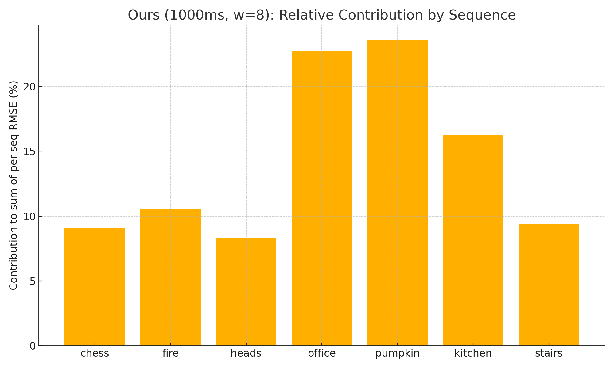

# VGGT-VSLAM demo
## 引入

<a id="intro"></a>
VGGT 的滑窗推理帧数有限：场景放大后无法一次性覆盖全局；同时其高速度往往依赖大型 GPU，普通设备难以长期实时。为在大场景下降低算力负担，我们采用 **VGGT 前端 + ORB-SLAM3 后端** 的组合，并通过 ROS2（Python VGGT + C++ ORB-SLAM3）解耦为可扩展的 demo。

核心思路是：将 VGGT 的几何输出作为“强先验”，后端再做本地优化精修（BA/ICP）。VGGT 在本系统中主要提供三类先验：

- **位姿先验**：作为 BA 初值，加速收敛并提高稳定性。
- **帧间稀疏对齐先验**：已知帧间配准，降低跨窗口关联与优化的开销。
- **稠密点云先验**：在先验约束下进行 ICP 细化定位与地图优化。

> 跨滑窗 Track ID 持久化、关键帧插入阈值、以及 Phase1/Phase2 的实现细节统一见 [VGGT-VSLAM 架构解析](#arch) 的 [主要算法](#arch-algo) 与 [问题与解决](#arch-issues)。

## 项目总览

<a id="overview"></a>
本仓库将 **ORB-SLAM3** 后端与 **VGGT（Visual Geometry Grounded Transformer）** 前端融合，在 ROS2（Humble）下提供可扩展的 VSLAM 原型：VGGT 提供快速几何先验（内外参/深度/点/跟踪/位姿窗口），ORB-SLAM3 负责关键帧管理、（可选）回环与地图维护，并在本地优化阶段引入“稀疏先验 + 稠密 ICP”的两阶段精修。

> “三类先验”的定义见 [引入](#intro)；两阶段精修（Phase1/Phase2）的具体做法见 [架构解析/主要算法](#arch-algo)。

### 运行效果示意

**轨迹示意图**



**地图示意图**



### 核心特性
- **VGGT 前端**：滑窗推理并发布几何先验（见 [引入](#intro)），为 Tracking/Mapping 提供强约束。
- **ORB-SLAM3 后端**：成熟的关键帧、地图与优化框架，承担持续建图与位姿输出。
- **ROS2 原生解耦**：Frontend/Tracking/Mapping/Eval/Player 节点拆分，便于分布式或异构部署。
- **评估链路**：提供 TUM 与 7-Scenes 在线 ATE 评估与 CSV 日志。

### 代码结构速览
```text
src/
	orb_slam3_driver/        # Python 驱动示例节点（单目 EuRoC 测试）
	orb_slam3_lib/           # ORB-SLAM3 源码与第三方库 (DBoW2, g2o, Sophus)
	orb_slam3_tracking/      # Tracking 节点 (C++)
	orb_slam3_mapping/       # Mapping 节点 (C++)
	orb_slam3_vggt_frontend/ # VGGT 前端集成 (C++)
	vggt_ros/                # VGGT 在 ROS2 中的 Python 接口封装
	video_reader/            # 视频读入与摄像头参数示例
	vslam_bringup/           # 系统级 launch / 参数汇总
	vslam_msgs/              # 自定义消息类型 (KeyFramePtr 等)
	vslam_evals/             # 在线评估节点与 launch（TUM/7-Scenes，ATE 统计与日志）
tools/                     # 数据与评估工具脚本
vggt/                      # 原始 VGGT Python 包及训练/示例脚本
```

### 参数调优
参数集中在 `vslam_bringup/config/vslam_params.yaml`，也可运行时用 `ros2 param set <node> <name> <value>` 在线覆盖。按消费点分组：
- `vggt_ros/vggt_node.py`（Python 前端，滑窗/尺度守护）：`model_name/device` 决定权重与推理设备；`window_size/min_parallax` 传入 `KeyframeSelector` 控制滑窗长度与插帧阈值（`keyframe_selector.py`）；`track_visibility_threshold` 用于可见性掩码，低于阈值的 track 被丢弃；`scale_enable/scale_min_overlap_ratio/scale_jump_lower/scale_jump_upper` 约束尺度融合：需要至少 `ceil(window_size*scale_min_overlap_ratio)` 个重叠帧才融合，融合尺度若跳变超出上下限则拒绝（见 `vggt_node.py` 中 scale fuse 分支）。
- `orb_slam3_vggt_frontend/vggt_frontend_node.cpp`（C++ Frontend → Tracking/Optimizer）：
	- 稠密融合：`dense.voxel_size/dense.min_points_per_voxel/dense.max_range` 设成 `VGGTDenseConfig`，下发给 `Tracking::SetVGGTDenseConfig` 与 `Optimizer::SetVGGTDenseConfig`，用于前端 `FuseVGGTKeyframeDenseCache` 与后端 `FuseDenseObservations` 的体素分箱、半径裁剪与最少点数门槛。
	- Phase2 ICP：`enable_vggt_phase2` 调用 `Optimizer::SetVGGTPhase2Enabled`；`dense.phase2_radius`/`dense.phase2_max_edges` 分别约束对应距离与采样规模（Phase2 行为定义见 [架构解析/主要算法](#phase2)）。
	- 动态内参：`override_intrinsics_from_vggt` 开启后，在回调中用 `/vggt/output` 的 `intrinsic_avg` 覆盖 ORB；若当前地图点数少于 `min_map_points_for_intrinsic_update` 或相对变化 <5% 则跳过，避免早期抖动；首次无内参时允许小幅更新。
	- 基础 ORB 参数：`voc_file/settings_file/use_viewer` 仅在节点启动时构造 ORB-SLAM3 `System`。
- `Optimizer.cc`（后端）：`enable_vggt_phase2` 通过全局原子 `g_enable_vggt_phase2` 控制 `RunVGGTLBALocal`；`dense.*`、`phase2_*` 在 Phase1/Phase2 融合与采样处打印和使用（体素、范围、采样上限）。
- 视频输入：`video_reader` 节点消费 `video_path/camera_name/use_sensor_data_qos/camera_info_url`，用于打开视频、选择 QoS 与加载标定（仅影响数据源，不改算法）。


## VGGT-VSLAM 架构解析

<a id="arch"></a>

### 核心节点（ROS2）

<a id="arch-nodes"></a>
- `vggt_ros/vggt_node`（Python）：滑窗选帧、VGGT 推理、尺度守护，发布 `/vggt/output`（含稠密轨迹/点云/内参均值等）；就绪时在 `/vggt/model_ready` 发布一次性通知。
- `orb_slam3_vggt_frontend/vggt_frontend_node`（C++）：消费 `/vggt/output`，将 VGGT 轨迹/点云/姿态变为 ORB-SLAM3 `TrackVGGT` 输入，并发布关键帧指针给 Mapping。
- `orb_slam3_tracking/tracking_node`（C++）：初始化 `System` 并驱动 Tracking；VGGT 模式主要逻辑位于 `Tracking::GrabImageVGGT/TrackVGGT`。
- `orb_slam3_mapping/mapping_node`（C++）：接收 KeyFramePtr/SystemPtr 启动后端线程，发布 `/vslam/pose_optimized`。
- `vslam_evals/eval_node`（Python）：订阅 `/vslam/pose_optimized`，在 `/dataset_done` 后计算 ATE 并写 CSV；等待 `/vggt/model_ready` 后触发 `/dataset_start`。
- 播放器：`tum_player/tum_player_node`（TUM `rgb.txt`）与 `vslam_evals/seven_scenes_player_node`（7-Scenes `*.color.png`），结束均发布 `/dataset_done`。

### 组件与职责
- `orb_slam3_vggt_frontend/src/vggt_frontend_node.cpp`：ROS2 组件节点，订阅 `/vggt/output`（`VggtOutput`），解析滑窗 3D/2D track、相机姿态和融合点云，构造 ORB-SLAM3 前端可用的特征、Track ID、颜色、VGGT 估计位姿增量，并将关键帧指针发布给后端 Mapping。
- `orb_slam3_tracking/src/tracking_node.cpp`：基础 Tracking-only 节点（Monocular/RGBD/IMU），初始化 `System` 并转发关键帧指针；VGGT 模式下主要逻辑在 `Tracking::GrabImageVGGT/TrackVGGT`。
- `orb_slam3_lib/orb_slam3/src/Tracking.cc`：VGGT 专用前端逻辑（Track ID 关联、VGGT 位姿种子、区域覆盖判定、关键帧生成）和稠密缓存管理。
- `orb_slam3_lib/orb_slam3/src/Optimizer.cc`：引入 VGGT 稠密/稀疏本地 BA，两阶段求解（Phase1 位姿+稀疏 MapPoint 先验，Phase2 可选的点到平面稠密 ICP），以及稠密点体素融合。

### 关键数据流（时序）

<a id="arch-dataflow"></a>
1. **VGGT 输出 → Frontend**：`VggtFrontendNode::VggtCallback` 将最新帧图像转灰度，解析 `tracks_3d/tracks_2d` 和 `tracks_mask`，恢复 stride 网格上的 `(u,v)`，生成 `KeyPoint`、全局 Track ID、对应 3D 点（VGGT 世界系）与颜色；从 `camera_poses` 构建滑窗 `PoseWindow` 并计算相邻窗口的 `delta_pose`（SE(3)）。
2. **世界对齐与位姿增量**：节点维护 `world_from_vggt_`，若滑窗有重叠则用重叠帧求对齐矩阵并累计；将 VGGT 增量转换到 SLAM 世界系后传入 Tracking。
3. **进入 Tracking**：`Tracking::GrabImageVGGT` 接收灰度图、特征/Track ID/3D 点、颜色、滑窗姿态、可见性遮罩、稠密点云等，记录 `mVGGTDeltaT`，创建 `Frame`（包含 `mvTrackIds`、`mvVGGT3Dpoints` 与稠密缓存），然后调用 `TrackVGGT`。
4. **位姿种子与匹配**：`TrackVGGT` 先尝试用滑窗相对姿态对最后关键帧做种子，否则累积 `mVGGTDeltaT`；`MatchByTrackIds()` 用全局 Track ID 将上一帧 MapPoint 直接关联到当前帧，匹配分布再按 20×15 区域覆盖率筛选，避免局部退化。
5. **关键帧策略**：`NeedNewKeyFrameVGGT` 结合帧间距、LocalMapping 状态、区域覆盖、新点比例、以及 VGGT delta 的运动幅度决定插帧；`CreateNewKeyFrameVGGT` 在插帧前调用 `PopulateFrameDenseStorage` 与 `FuseVGGTKeyframeDenseCache` 将稠密点体素融合后写入 KeyFrame 缓存，并通过回调发布给 Mapping。
6. **稠密/稀疏优化**：Local Mapping 调用 `RunVGGTLBALocal`（`Optimizer.cc`），按 Phase1（稀疏先验位姿优化）与可选 Phase2（稠密 ICP 精修）更新关键帧位姿与稠密缓存。

> Phase1/Phase2 的目标函数与采样策略统一见 [主要算法](#arch-algo)（[Phase1](#phase1)、[Phase2](#phase2)）。

### 主要算法

<a id="arch-algo"></a>

<a id="track-id"></a>
- **Track ID 跨窗复用与网格编码**：前端滑窗为特征分配全局 Track ID；`Tracking` 以 `mVGGTTrackIdToMP` 持久化 ID→MapPoint，并用 20×15 网格编码（`LookupVGGTGridGlobalId/InsertVGGTGridMapping`）。`CreateNewKeyFrameVGGT` 重置消费状态、继承上一 KF 的全局 ID 与可见性，保证滑窗外仍能复用同一 MapPoint，减少重复建图。
- **位姿种子链路与增量积累**：优先使用滑窗重叠帧相对姿态作为种子；否则累计 `mVGGTDeltaT` 左乘到上一 KF 世界位姿得到当前播种。`mAccumulatedVGGTMotion` 连续保存关键帧间运动，长期抑制漂移；无先验再退回速度模型。

<a id="kf-policy"></a>
- **关键帧判定与继承**：`NeedNewKeyFrameVGGT` 以可见度和帧间隔双阈值（可见度<0.3 或间隔≥7 强触发；可见度<0.7 或间隔≥2 且 LocalMapping 空闲时软触发）。插帧前 `FuseVGGTKeyframeDenseCache` 体素融合当前稠密；插帧时继承上一 KF 的稠密点引用与全局 Track ID，并合并上一 KF 的稠密点云，保证后端 Phase1/Phase2 有可用先验。
- **稠密体素融合（前后端一致）**：`FuseVGGTKeyframeDenseCache` 将稠密观测按体素聚类，聚合 RGB/空间均值生成压缩彩色点云；缓存到 KF 与 Tracking 一致的体素逻辑，既降噪又保持尺度一致，为 Phase2 与地图更新提供统一输入。

<a id="phase1"></a>
- **Phase1 位姿优化（稀疏先验）**：`CollectVGGTPhase1Priors` 仅收集非新增（`isNew==0`）的 MapPoint 作为 reused 先验；构建三维残差 `EdgeVGGTDistance`，Huber 阈值 $\sqrt{7.815}$，仅优化相机位姿：
	$\displaystyle \min_{R,t}\sum_i \rho\big(\|R P_i^{w}+t - p_i^{c}\|_2^2\big)$。
  无 reused 先验则直接跳过。`ApplyVGGTPhase1Result` 将新先验写回世界坐标并更新 KF 姿态。

<a id="phase2"></a>
- **Phase2 彩色 ICP（稠密对齐）**：`CollectVGGTPhase2Priors` 先用缓存的相机系稠密样本（stride=6，含 RGB+xyz）作为观测，再补齐超出的稠密引用点并用当前姿态投到相机系；继承上一 KF 的稠密 refs 确保有目标。目标点从 VGGT MapPoint 中按 **1m 内均匀、1/r³ 加权** 采样，源观测子采样并受 `phase2_max_edges` 限制（最多 4×目标）。`RunVGGTPhase2` 调用 Open3D Colored ICP（阈值受 `phase2_radius`、`phase2_voxel_size`）最小化
	$\displaystyle E(T)=\sum_j w_g\|p_j - T q_j\|_2^2 + w_c\,\|I(p_j)-I(q_j)\|_2^2$，
  输出姿态用于 `ApplyVGGTPhaseResult` 更新 KF 位姿、融合稠密观测+先验、并扩充或更新 VGGT MapPoint。

---

### 问题与解决

<a id="arch-issues"></a>
- **滑窗外对齐易失效**：插帧阈值与继承机制见 [关键帧判定与继承](#kf-policy) 与 [Track ID 跨窗复用](#track-id)，这里不再重复。
- **稀疏先验不足导致 Phase1 跳过**：`CollectVGGTPhase1Priors` 仅收集 `isNew==0` 的 MapPoint 作为 reused 先验；当全是新增点时 Phase1 自动跳过以抑制噪声。通过全局 Track ID 继承与网格复用，提升“可复用”占比，减少 Phase1 被跳过的几率。
- **稠密 ICP 缺样/过载**：继承上一 KF 的稠密 refs，先用缓存的相机系稠密样本作为观测，再补齐引用点投到相机系；目标点按 1m 内、1/r³ 加权采样并受 `phase2_max_edges` 上限（源观测 ≤4×目标）约束，既避免无对应又控制 ICP 计算量。
- **算力与实时性冲突**：`RunVGGTLBALocal` 若无 Phase1/2 先验直接返回；Phase1 仅在有 reused 先验时运行，Phase2 可通过 `SetVGGTPhase2Enabled` 全局关闭。计时日志只在执行时输出，前端重计算与后端轻优化解耦，降低常态算力占用。

## 面向 7-Scenes 数据集的 vSLAM 评估流水线

### 评估系统架构概览
## 7-Scenes 基准（未标定设定）

本节报告 **7-Scenes** 基准 7 个序列（*chess, fire, heads, office, pumpkin, kitchen, stairs*）的**绝对轨迹误差（ATE）RMSE**（平移，单位米）。RMSE 越小表示轨迹精度越高。

### 评估指标与流程

- **指标：** 使用 **Umeyama 相似变换（Sim3）** 将估计轨迹对齐到真实值后，基于逐帧欧氏平移误差计算平移 ATE RMSE。
- **尺度处理：** 评估流水线设置 `align_scale=True`，对齐时包含全局**尺度**因子，因此报告的 ATE RMSE 主要反映**轨迹形状/一致性**，而非绝对尺度（对单目或尺度不确定系统尤为重要）。
- **平均值（Avg）：** 对 7 个序列 RMSE 取算术平均（与表中数值一致，差异仅来自四舍五入）。

---

### 图示摘要

**(a) 原始基准表（未标定）**



**(b) 各方法平均 RMSE**



**(c) 我们的方法：算力预算 vs 平均 RMSE**



**(d) 我们的方法：按序列 RMSE vs 算力预算**



**(e) 我们（1000ms）与 DROID-SLAM*：按序列 RMSE 差异**



**(f) 我们（1000ms）：哪些序列主导 Avg**



---

### 数值结果（ATE RMSE，米）

| 方法 | chess | fire | heads | office | pumpkin | kitchen | stairs | 平均 |
|---|---|---|---|---|---|---|---|---|
| DROID-SLAM* [65] | 0.047 | 0.038 | 0.034 | 0.136 | 0.166 | 0.080 | 0.044 | 0.078 |
| MAS3R-SLAM* [44] | 0.063 | 0.046 | 0.029 | 0.103 | 0.114 | 0.074 | 0.032 | 0.066 |
| MIT (SL(4), w=8) | 0.041 | 0.060 | 0.043 | 0.106 | 0.206 | 0.054 | 0.078 | 0.084 |
| MIT (SL(4), w=32) | 0.036 | 0.028 | 0.018 | 0.103 | 0.133 | 0.058 | 0.093 | 0.067 |
| Ours (1ms, w=8) | 0.102 | 0.085 | 0.090 | 0.203 | 0.218 | 0.142 | 0.115 | 0.136 |
| Ours (220ms, w=8) | 0.063 | 0.066 | 0.057 | 0.145 | 0.196 | 0.133 | 0.083 | 0.106 |
| Ours (1000ms, w=8) | 0.056 | 0.065 | 0.051 | 0.140 | 0.145 | 0.100 | 0.058 | 0.088 |

---

### 详细分析

#### 1）Avg RMSE 总体排名

从 Avg 列可见：

- **MAS3R-SLAM*** 平均最优（**0.066 m**），其次是 **MIT (w=32)**（**0.067 m**）和 **DROID-SLAM***（**0.078 m**）。
- 我们的最佳配置 **Ours (1000ms, w=8)** 为 **0.088 m**，即：
  - 比 **DROID-SLAM*** 差 **+0.010 m**（*+12.8%*），
  - 比 **MAS3R-SLAM*** 差 **+0.022 m**（*+33.3%*），
  - 比 **MIT (w=8)** 差 **+0.004 m**（*+4.8%*），
  - 比 **MIT (w=32)** 差 **+0.021 m**（*+31.3%*）。

尽管与最强基线仍有差距，但就 Avg RMSE 而言，我们的最佳配置已**接近 MIT (w=8)**，并呈现出**序列依赖的优势**（见下文）。

---

#### 2）算力预算对我们方法的影响（**w=8**）

评估了三档算力预算：**1ms**、**220ms**、**1000ms**（均使用窗口 `w=8`）。Avg 随算力提升呈**单调下降**：

- Avg：**0.136 → 0.106 → 0.088 m**
- 1ms→1000ms 绝对下降：**0.048 m**
- 1ms→1000ms 相对下降：**35.3%**
- 220ms→1000ms 相对下降：**17.0%**

各序列（1ms→1000ms）的改进如下：

| 序列 | 1ms | 220ms | 1000ms | 绝对下降 (1→1000) [m] | 相对下降 (1→1000) | 相对下降 (220→1000) |
|---|---|---|---|---|---|---|
| chess | 0.102 | 0.063 | 0.056 | 0.046 | 45.1% | 11.1% |
| fire | 0.085 | 0.066 | 0.065 | 0.020 | 23.5% | 1.5% |
| heads | 0.090 | 0.057 | 0.051 | 0.039 | 43.3% | 10.5% |
| office | 0.203 | 0.145 | 0.140 | 0.063 | 31.0% | 3.4% |
| pumpkin | 0.218 | 0.196 | 0.145 | 0.073 | 33.5% | 26.0% |
| kitchen | 0.142 | 0.133 | 0.100 | 0.042 | 29.6% | 24.8% |
| stairs | 0.115 | 0.083 | 0.058 | 0.057 | 49.6% | 30.1% |
| avg | 0.136 | 0.106 | 0.088 | 0.048 | 35.3% | 17.0% |

**要点：**

- **220ms → 1000ms** 的**额外**收益主要在：
  - **stairs (↓30.1%)**、**pumpkin (↓26.0%)**、**kitchen (↓24.8%)**，
  表明这些序列对更高算力（更充分的优化/更强全局一致性校正）收益显著。
- 相比之下，**fire (↓1.5%)** 与 **office (↓3.4%)** 在 220ms 以上呈现**收益递减**，说明其主要误差源可能对算力不敏感（如前端观测质量，而非后端迭代预算）。

---

#### 3）深入分析：**Ours (1000ms, w=8)** —— 按序列解读

最佳配置对应行：

- chess **0.056**，fire **0.065**，heads **0.051**，office **0.140**，pumpkin **0.145**，kitchen **0.100**，stairs **0.058**，Avg **0.088**。

**(a) 与 DROID-SLAM* 在 office 接近，并在 pumpkin 更优**

- **office：** **0.140 m** vs DROID-SLAM* **0.136 m**（**+0.004 m**，*+2.9%*）。  
  基本处于**同一量级**，说明该场景跟踪与全局一致性具备竞争力。
- **pumpkin：** **0.145 m** vs DROID-SLAM* **0.166 m**（**-0.021 m**，*-12.7%*）。  
  这是表中我们唯一优于 DROID-SLAM* 的序列，暗示该场景可能是流水线的强项。

参考：相对 DROID-SLAM* 的按序列差值如下：

| 序列 | Δ vs DROID [m] (Ours1000 - DROID) |
|---|---|
| chess | +0.009 |
| fire | +0.027 |
| heads | +0.017 |
| office | +0.004 |
| pumpkin | -0.021 |
| kitchen | +0.020 |
| stairs | +0.014 |
| avg | +0.010 |

**(b) 与 MIT (w=8) 的互补：pumpkin/stairs 强，kitchen 弱**

将最佳配置与 **MIT (w=8)** 对比：

| 序列 | MIT(w=8) [m] | Ours1000 [m] | Δ (Ours-MIT) [m] |
|---|---|---|---|
| chess | 0.041 | 0.056 | +0.015 |
| fire | 0.060 | 0.065 | +0.005 |
| heads | 0.043 | 0.051 | +0.008 |
| office | 0.106 | 0.140 | +0.034 |
| pumpkin | 0.206 | 0.145 | -0.061 |
| kitchen | 0.054 | 0.100 | +0.046 |
| stairs | 0.078 | 0.058 | -0.020 |
| avg | 0.084 | 0.088 | +0.004 |

- 我们**更优**的序列：
  - **pumpkin：** 0.145 vs 0.206（**-0.061 m**，*-29.6%*）
  - **stairs：** 0.058 vs 0.078（**-0.020 m**，*-25.6%*）
- 我们**明显更差**的序列：
  - **kitchen：** 0.100 vs 0.054（**+0.046 m**，*+85.2%*）

这说明一个关键点：**仅看 Avg RMSE 会掩盖按场景的取舍**。我们的方法并非全局劣势，在部分困难场景有明显优势，但在另一些场景仍有短板。

**(c) Fire / Heads：与最优基线仍有较大差距**

即便在 1000ms 配置，仍是：
- **fire：** 0.065 m，对比最佳基线 0.028 m（MIT w=32）；
- **heads：** 0.051 m，对比最佳基线 0.018 m（MIT w=32）。

此外，220ms→1000ms 的边际收益在 fire 很小（↓1.5%），heads 也有限（↓10.5%），提示进一步提升可能需要**更强前端约束/鲁棒性**，而非单纯增加算力。

---

#### 4）是什么拉高了 Avg —— 后续应重点改进哪里

虽然 Avg 是各序列的等权平均，但误差主要由三个序列主导。

**Ours (1000ms, w=8)** 对 RMSE 总和的按序列贡献：

| 序列 | Ours 1000ms RMSE [m] | 占总和比例 |
|---|---|---|
| chess | 0.056 | 9.1% |
| fire | 0.065 | 10.6% |
| heads | 0.051 | 8.3% |
| office | 0.140 | 22.8% |
| pumpkin | 0.145 | 23.6% |
| kitchen | 0.100 | 16.3% |
| stairs | 0.058 | 9.4% |

贡献最大的序列：

- **pumpkin (~23.6%)**
- **office (~22.8%)**
- **kitchen (~16.3%)**

三者合计占**约 62–63%** 的 RMSE 总量。  
因此若要继续降低 Avg，通常从改进 **office / pumpkin / kitchen** 获得的收益最大，而不是进一步优化已很小的 chess/heads。

---

### 结论要点

- 提升算力显著改善精度：Avg RMSE 从 **0.136 m**（1ms）降至 **0.088 m**（1000ms），降低 **35.3%**。
- 1000ms 配置在 **stairs/pumpkin/kitchen** 上带来最大额外收益，而 **fire/office** 在 220ms 以上收益递减。
- 最佳配置在 **office** 接近 **DROID-SLAM***，在 **pumpkin** 优于 **DROID-SLAM***，但在 **fire/heads/kitchen** 仍落后于最强方法。
- 若要进一步降低 Avg，应优先改进 **office/pumpkin/kitchen**，它们占主导误差。


**来源：** 以上分析基于 `vslam_evals` 中评估节点与 7-Scenes 播放器的源码，包括 `eval_node.py`、7-Scenes 的 launch 配置及对应的播放节点实现。基准结果来自所附对比图，所有代码引用与图示旨在准确描述评估流水线功能及其性能背景。


## 评估系统架构概览

`vslam_evals` 模块提供基于 ROS2 的评估框架，用于将视觉 SLAM 结果与真实轨迹对比评估，并为 TUM、7-Scenes 等已知数据集提供专门支持。系统由通过 launch 配置编排的模块化节点组成：

- **数据集播放节点**：针对 7-Scenes，自定义节点（`seven_scenes_player`）从磁盘读取数据集图像并发布为相机帧。它以受控速率将图像发布到 `/camera/image_raw`，模拟序列回放。发布最后一帧后，会在 `/dataset_done` 发布空消息以标记完成。播放节点可在开始前等待显式启动信号（`/dataset_start`）。

- **vSLAM 系统节点**：主要 SLAM 算法（通过 `vslam_system.launch.py` 启动）订阅图像主题并执行视觉 SLAM，生成实时位姿估计，并将优化后的相机位姿发布到某个主题（如 `/vslam/pose_optimized`）。在此设置中，SLAM 系统不使用实时相机流，而是依赖数据集播放器提供的图像（launch 中将 `use_video` 设为 `false`）。

- **评估节点**：专用节点（`vslam_evals` 包中的 `eval_node`）监听 SLAM 输出位姿，在序列结束后与真实值比较。它订阅 SLAM 位姿主题并在内部累积所有带时间戳的估计位姿，同时监听数据集完成信号，在序列结束后触发评估。评估节点加载该序列的真实轨迹，将估计轨迹与真实轨迹对齐，计算误差指标（绝对轨迹误差，ATE），并记录结果。

上述组件一同启动。例如 `eval_7scenes_office.launch.py` 在一个 `LaunchDescription` 中包含数据集播放器、vSLAM 系统和评估节点，确保它们正确启动和通信。该架构将数据回放、SLAM 计算与评估清晰解耦，有利于基准测试与可重复性。

### 评估流程

端到端的 7-Scenes 序列评估通过 ROS2 主题与回调协同完成，流程可概括为以下几个阶段：

1. **启动与就绪：** 所有节点启动后，评估节点等待 SLAM 系统发送就绪信号。SLAM 系统（或相关辅助节点）在完成必要初始化（如加载地图或模型）后，会在 `/vggt/model_ready` 发布布尔就绪标志。评估节点订阅该主题，收到 `True` 消息（且尚未启动）后，会在 `/dataset_start` 发布空消息。若 `SevenScenesPlayer` 配置为等待启动信号，这将触发其开始回放。（播放器参数 `wait_for_start` 默认为 `True`，意味着在收到该信号前保持空闲。）

2. **数据集回放与位姿收集：** `SevenScenesPlayer` 节点从指定序列目录读取图像文件（如 `*.color.png` 帧），并按设定帧率将其作为 `sensor_msgs/Image` 发布到 `/camera/image_raw`。实际播放速率可通过倍率参数（`play_rate`）调整。对 7-Scenes，源数据约 30 FPS，`play_rate` 默认值为 `1.0`（实时）。播放器使用定时器以 `period = 1/(fps * play_rate)` 秒的间隔发布每帧，为每条图像消息附加递增时间戳（模拟原始序列时间戳）后发送。SLAM 系统处理这些图像并生成位姿估计。vSLAM 系统在 `/vslam/pose_optimized` 主题上以 `PoseStamped` 发布每帧的**估计相机位姿**（位置与姿态）。评估节点订阅该主题，并将每条收到的位姿连同时间戳存入列表。每条记录是时间、位置 `(x, y, z)` 和姿态四元数 `(x, y, z, w)` 的元组，对应该帧的估计位姿。

3. **完成信号与真实值加载：** 数据集播放器发布最后一帧后，会调用 `_finish()` 并在 `/dataset_done` 发布 `std_msgs/Empty` 消息。评估节点订阅这一完成主题，因此在序列结束时会收到通知。收到 `/dataset_done` 后，评估节点会短暂等待（代码中为 10 秒）以确保最后的位姿消息或 SLAM 处理完成，然后加载提供的 `groundtruth_path` 中的真实轨迹。真实文件应为 TUM RGB-D 数据集格式，即每行包含时间戳和真实位姿 `(tx, ty, tz, qx, qy, qz, qw)`。`load_tum_trajectory` 会读取该文件，跳过以 `#` 开头的注释，将每行解析为带时间戳的位姿元组列表。如果文件缺失或为空，评估节点会记录错误并终止评估；否则得到真实位姿列表。

4. **位姿的时间对齐：** 在计算误差前，需将估计轨迹与真实轨迹按时间对齐。评估节点会按时间戳对真实与估计位姿列表排序，然后调用 `associate_by_time(gt, est, max_diff)` 在时间窗口内配对。参数 `max_time_diff`（在 7-Scenes 的 launch 中设为 `0.01 s`）定义了时间戳匹配的容差。关联函数遍历每个估计时间戳，找到最近的真实时间戳，若差值 `<= max_diff` 则标为匹配。为避免重复，每个真实位姿最多与一个估计值匹配：选择最近的一对后忽略其它候选。结果是一组索引对，将时间上对应的真实与估计位姿关联。如果无法配对（如时间戳偏差过大），评估节点会记录警告并退出，不再计算误差。

5. **对齐后的 ATE 计算：** 通过时间关联的位姿对，评估节点提取匹配位姿的 `(x, y, z)` 位置分量以计算**绝对轨迹误差（ATE）**。在计算误差前，可先将估计轨迹对齐到真实轨迹。当前实现使用最小二乘刚体变换（**Umeyama 方法**），可选地允许尺度调整。launch 文件为 7-Scenes 设置 `align_scale: True`，即执行**相似变换（Sim3）** 对齐（尺度 + 旋转 + 平移）以最优拟合估计点到真实点。内部调用 `compute_ate(...)` 时会执行 `umeyama_alignment(est_xyz, gt_xyz, with_scale=True)`。`umeyama_alignment` 计算最小化估计点与真实点均方误差的旋转 `R`、平移 `t` 与尺度因子 `s`。若启用尺度对齐，会比较点集方差求得最佳尺度，并应用 `est_aligned = s * R * est_xyz + t`。若禁用对齐，则直接使用原始估计坐标计算误差。最后，ATE 为对齐后估计位置与真实位置之间的欧氏距离，得到每帧的平移误差数组（单位米）。

6. **误差指标计算：** 根据逐帧 ATE，评估节点计算汇总统计量：均方根误差（RMSE）、平均误差、中位数、标准差、最大值与最小值。RMSE 是主要指标，计算公式为 `sqrt(mean(error^2))`，对大误差更敏感；平均/中位数反映整体偏差，最大/最小界定误差范围。记录的位姿配对数量 `N` 也会输出（即成功匹配的帧数）。

7. **日志与输出：** 评估结果会同时打印到控制台并写入 CSV 文件。`EvalNode` 的控制台日志会报告 `N` 和各项指标，例如：

```text
"[EvalNode] N=500, ATE_RMSE=0.142 m, mean=0.120, median=0.106, std=0.045, max=0.203, min=0.057"
```

此外，`eval_node` 会向 CSV 文件（在该 launch 中默认名为 `evals_7scenes.csv`）追加一行，便于汇总不同运行结果。首次写入会生成表头，此后每次写入包含：序列名、运行 ID、播放倍率、`N`、`RMSE`、`mean`、`median`、`std`、`max`、`min`。例如表头与样例条目：

```text
seq_name,run_id,play_rate,N,rmse,mean,median,std,max,min
office/seq-01,run_001,1.0,500,0.142,0.120,0.106,0.045,0.203,0.057
```

序列名来自参数或从真实轨迹路径推断，`run_id` 是用户设定的运行标识（默认为 `"run_001"`）。日志文件位置由评估节点确定：优先写入包的 `logs` 目录（如 `<vslam_evals_package>/logs/evals_7scenes.csv`），若失败（例如非安装环境运行），则退回当前工作目录下的 `logs` 文件夹。这样可以确保所有评估运行都被记录，便于后续分析。写入结果后，评估节点记录完成信息并关闭 ROS 节点（内部调用 `rclpy.shutdown()`）。


## 评估指标

主要计算的指标是**绝对轨迹误差（ATE）**的平移部分。所有指标均来源于逐帧 ATE 的分布：

- **ATE RMSE：** 平移误差的均方根。单一汇总数值（米），越小越好。RMSE 对离群值敏感，少量大偏差会显著拉高该指标。
- **平均值与中位数 ATE：** 平均误差给出总体偏差，中位数代表误差的中心趋势，更不受离群值影响。如果平均值远大于中位数，说明少数大误差拉高了平均值。
- **标准差（Std）：** 衡量误差的离散程度。标准差小表示各帧误差较一致，标准差大则说明某些帧误差明显更大。
- **最大值与最小值：** 记录误差的极值——最坏漂移和最佳（最接近对齐）的帧，可帮助发现是否存在灾难性失败或完美对齐的情况。
所有这些指标都在估计轨迹与真实轨迹完成最优对齐后计算。特别是 7-Scenes 将 `align_scale=True`，会调整轨迹尺度以最小化误差。若 SLAM 系统的尺度并非由传感器固有固定（如单目 SLAM 仅能恢复形状尺度不定），对齐尺度有助于评估聚焦轨迹形状与相对精度。**RMSE** 常作为 7-Scenes 基准的核心对比指标。评估节点以米为单位、三位小数精度记录各指标，并写入 CSV 供后续分析。研究者可用 CSV 统计跨序列的平均值或绘制误差分布。

## 7-Scenes 评估的 Launch 配置

7-Scenes 的评估由 `eval_7scenes_office.launch.py` 配置（默认以 “office” 场景命名）。该 launch 可参数化以运行 7-Scenes 中任意场景/序列。关键配置包括：

- **场景与序列选择：** 声明参数 `scene`（默认 `"office"`）和 `seq`（无默认，需指定，如 `"seq-01"`），用于确定运行的场景与序列目录。数据集结构假定为 `<data_root>/7-scenes/<scene>/<seq>/`，其中包含图像及 `groundtruth.txt`。

- **数据集路径：** 参数 `data_root`（默认 `"/DATA_ROOT"`）与 `dataset_dir`（默认 `"7-scenes"`）定义数据集存放位置。结合场景与序列，构造序列完整路径（`seq_root`）及真实轨迹文件路径（`gt_path = .../groundtruth.txt`）。

- **播放速率：** `play_rate`（默认 `1.0`）控制播放速度相对于原始速度的倍数。如 `play_rate=2.0` 将以两倍速播放（便于快速测试），而较慢速率（如 `0.5`）可为 SLAM 每帧提供更多处理时间。该参数传递给播放器与评估节点以保持时间一致性。

- **SevenScenesPlayer 节点：** launch 引入 `seven_scenes_player` 节点，参数设定 `seq_root`（序列目录）、`fps=30.0`（7-Scenes 名义帧率）以及所选 `play_rate`。播放器据此发布 `/camera/image_raw` 并在结束时发信号。默认 `wait_for_start` 为 true，节点启动时会记录 “Waiting for /dataset_start...”，仅在评估节点触发后开始。

- **vSLAM 系统引入：** 通过 `IncludeLaunchDescription` 启动 `vslam_bringup` 包中的 `vslam_system.launch.py`，并传入 `use_video:=false` 覆盖默认实时视频源，使 SLAM 使用播放器发布的 `/camera/image_raw` 作为图像输入。

- **评估节点参数：** `eval_node` 在本配置中使用多项关键参数：
  - `groundtruth_path`：设置为该序列的 groundtruth.txt 路径，供加载真实轨迹。
  - `max_time_diff`：设为 **0.01 秒**（10 ms），严格的时间戳匹配容差。播放器时间戳与真实值几乎同步（按索引/帧率生成），小容差确保仅匹配同一时刻的帧。
  - `align_scale`：7-Scenes 设为 **True**，启用轨迹尺度校正。如前所述，可公平评估可能不保持尺度的算法（如部分单目 SLAM）。尺度对齐后，评价聚焦于轨迹形状。
  - `seq_name`：由场景与序列组合（如 `"office/seq-01"`），用于输出标识（CSV、日志）。
  - `log_filename`：CSV 日志文件名（此处 `"evals_7scenes.csv"`）。为 7-Scenes 独立命名便于区分其他数据集（如 TUM 的 `evals_tum.csv`）。除非修改，所有 7-Scenes 结果都会写入该文件。
  - `play_rate`：同样传递给评估节点，虽不影响误差计算，但会记录在 CSV，方便分析不同播放速率对精度的影响。

使用该 launch 运行 7-Scenes 序列非常直接，例如：

```bash
ros2 launch vslam_evals eval_7scenes_office.launch.py scene:=office seq:=seq-02 data_root:=/path/to/dataset
```
launch 将播放 `office/seq-02` 图像、运行 SLAM、自动评估轨迹误差，并将 RMSE 等指标输出到控制台和 CSV。启动信号与主题名称的精心协调保证 SLAM 在正确时机接收图像，且评估仅在一切就绪后开始。

## 系统集成与节点通信

该评估依赖 ROS2 主题通信来集成各组件：

- **图像通道：** `SevenScenesPlayer` 在 `/camera/image_raw` 发布图像。SLAM 系统（通常包含特征、里程计、闭环等节点）通过其相机接口订阅该主题。只要监听标准图像主题，无需修改 SLAM 系统。

- **位姿反馈：** SLAM 系统在每帧将估计相机位姿发布到 `/vslam/pose_optimized`（具体名称取决于 SLAM，实现上假设视觉 SLAM 经过优化后发布 `PoseStamped`）。`EvalNode` 以队列 50 订阅该主题，将 ROS 时间戳转为秒并将位姿（时间戳 + 位姿分量）追加到内部列表。此累积轻量且不影响 SLAM，仅用于后处理。

- **启动信号握手：** 评估节点与播放器通过 `/dataset_start` 协调。播放器订阅该主题，配置为等待时，仅在收到消息后开始发布。评估节点创建 `/dataset_start` 发布器，初始不发消息；一旦收到 SLAM 模型就绪（`/vggt/model_ready`），会仅发布一次启动消息。双方为该主题设置 transient local（latched）QoS，即便评估节点先于播放器发送，消息也不会丢失。该机制确保图像仅在 SLAM 完全初始化后开始输入，防止丢帧或在未准备好时过载。

- **完成与关闭：** 播放器在序列结束时发布 `/dataset_done`。评估节点收到后开始评估，计算并记录结果后请求关闭 ROS 循环。实际运行中，这会结束评估节点（通常也结束该启动组中的所有节点，视 launch 配置而定），确保一次运行完成后进程干净退出。若需要串行运行多序列（不在本单次 launch 中，而是自动化脚本），关闭流程可能需另行处理。在本单次运行场景下，意图是完成一次序列评估后即退出。

整体集成实现无缝自动评估：启动后等待 SLAM 就绪，播放数据集，自动计算误差并停止。该设计最小化人工干预并确保各次运行时序一致，对公平基准尤为重要。节点解耦也使评估逻辑（如 ATE 计算方式）独立于 SLAM 算法，只要按约定主题发布位姿即可评估不同实现。

## 许可证与引用
- ORB-SLAM3 遵循 GPLv3（以仓库内对应许可为准）。
- VGGT 权重/许可存在“商业可用版本”与“非商业版本”的差异（以 `vggt/LICENSE.txt` 与所用权重说明为准）。
t
```bibtex
@article{ORBSLAM3_TRO,
	title={{ORB-SLAM3}: An Accurate Open-Source Library for Visual, Visual-Inertial and Multi-Map {SLAM}},
	author={Campos, Carlos AND Elvira, Richard AND Gómez, Juan J. AND Montiel, José M. M. AND Tardós, Juan D.},
	journal={IEEE Transactions on Robotics},
	volume={37}, number={6}, pages={1874-1890}, year={2021}
}

@inproceedings{wang2025vggt,
	title={VGGT: Visual Geometry Grounded Transformer},
	author={Wang, Jianyuan and Chen, Minghao and Karaev, Nikita and Vedaldi, Andrea and Rupprecht, Christian and Novotny, David},
	booktitle={CVPR}, year={2025}
}
```